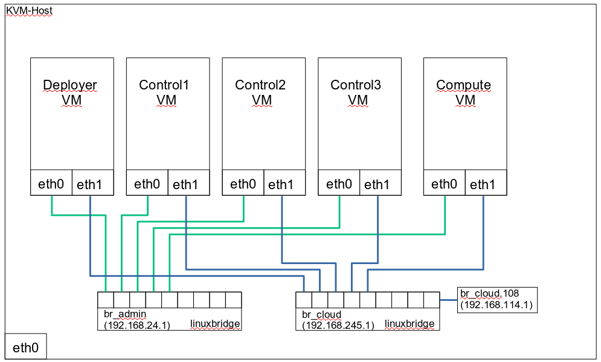

# Quick Guide SOC 8  Demo Installaiton

This document describe, how to setup the SUSE OpenStack Cloud 8 Release, based on CLM  can be installed on a SE laptop with 32 GB RAM. A default SOC 8 Installation need at least 64 GB available memory – only the removal of the Monasca Monitoring will help to install here. I have also removed the swift part - I would like to sell SES instead :-)

SOC8 is using cobbler to install the cloud nodes and relay on IPMI to control the nodes. This is not easy to provide in a full virtualized environment. I’m just skipping the bare-metal installation feature of SOC8 and will use pre-installed VM’s, which will be integrated in CLM (similar approach as crowbar_register in crowbar).  

This document is based on a opensuse42.3 host (Dell SE laptop) and is using KVM as hypervisor.



## Preparation:

We need some steps to prepare the host environment:
### 1. Network Setup:
I’m using a “dual” network setup to the cloud VM’s. The first interface is used for the CLM management (the crowbar-admin network). All other networks are placed on the second interface.
To be able to access all networks from the host system, I have created to linuxbridges and connect the network interfaces of the VM’s to each bridge. To be able to communicate with the virtual networks, assign IP-addresses to the bridge and create some tagged interfaces for the vlan based interfaces:

### 2. VM-Base Image:
As I don’t want to use cobbler for the bare-metal installation, we need some pre-installed virtual machines. The installed server has to met the following requirements:
- 100GB disk
- fixed IP address on the first network interface
- LVM based boot disk
- user “ardana” with group “ardana” exist, home directory /var/lib/ardana
- sudo rights for the ardana user
- passwd set for ardana (or copy your own public key)
- ssh public key of the ardana user is in the auhtorized_keys file (I will clone the image, and the ardana user must be able to login to the other nodes via ssh-key)
- sles12sp3-pool, sles12sp3-update and the cloud8iso repos are attached to the server

### 3. Repository Server:
I use my host as the Repos-Server and provide the needed repos to the VM’s via a local apache Server. The repos are synced from an external SMT server.

I run into an error during the first site deploy - the PTF repo has an unsigned meta info:

From the release notes:
```
ansible -m shell -a "sudo zypper -n --gpg-auto-import-keys ref -f PTF" list-of-new-nodes
``` 

For the basic setup, you need 5 virtual machines:

1 x Deployer Node (VM:  2GB RAM, 2 CPU’s, 2 NIC, 1x disk)

3 x Control Node (VM: 6 GB RAM, 2 CPU’s 2 NIC, 1x disk)

1 x Compute Node (VM: 4 GB RAM, 2 CPU’s. 2 NIC, 1x disk)

** ! make sure, that the network interfaces of each VM have the same PCI-BUS ID’s ! **

As “disk”, use a qcow2 based image. I created the base-image via DVD installation and configured it according to the requirements.  I used this qcow image as a backingfile and created for each VM a  cloned disk:
```
for i in cladmin.qcow2 clcompute1.qcow2 clcontrol1.qcow2 clcontrol2.qcow2 clcontrol3.qcow2 ; do  qemu-img create -f qcow2 -b cloud8_node_template_v1.1.qcow2 $i ; done”
```
Now you can start all virtual machines.
As a first step, you have to change the IP-addresses (they have all the same) and make sure, that you can login to each server as “ardana” user.

## SOC8 Deployment
Now we can start with the SOC deployment. All steps are done on the “deployer” node as user “ardana”:

#####  1. Install the Cloud pattern:
```
ardana@deploy:~> sudo zypper in -t pattern cloud_user
```

##### 2. Initialze the CLM service:
```
ardana@deploy:~> ardana-init
```
   The script ends with the next steps – we will not do all of them, as we skip the bare-metal installation of the nodes.

##### 3. Create / Modify the input model:
I have used the input model of the dev-env script (astack.sh) and modified it. If you use my model, you have to do some changes:

- ~/my_cloud/definition/data/servers.yml:

 change the “subnet” entry in the barmetal section to your used setup
 change the “ip-addr” entry for each server. As we are not depend on cobbler, the other values are not used and we can ignore them (like mac-addr, ilo,….)
- ~/my_cloud/definition/data/nic_mappings.yml:

  change the “bus-address” entry according to you virtual machines. (“ sudo lspci | grep Ether” shows the ID’s on the VM). If you have different bus-address, you have to add new mappings here and use this mapping in the server.yml file.
- ~/my_cloud/definition/data/net_global.yml:

  change the “cidr” and “gateway-ip” entry in the “ARDANA-NET” section to your used networks

##### 4. commit the input model:
The input model is managed in a local git repository. Any change here has to be commited:
```
cd /var/lib/ardana//openstack/ardana/ansible
git add -A
git commit -m "my first cloud"
```

now we can run the config processor (make sure you are in the /var/lib/ardana//openstack/ardana/ansible directory!)
```
ansible-playbook -i hosts/localhost config-processor-run.yml
```
if this shows no errors, we can ready the deployment:
```
ansible-playbook -i hosts/localhost ready-deployment.yml
```

##### 5. deploy the services on the nodes
In the last step, we use ansible to deploy all services on the nodes:
```
cd ~/scratch/ansible/next/ardana/ansible
ansible-playbook -i hosts/verb_hosts site.yml
```

… this take a while ….
